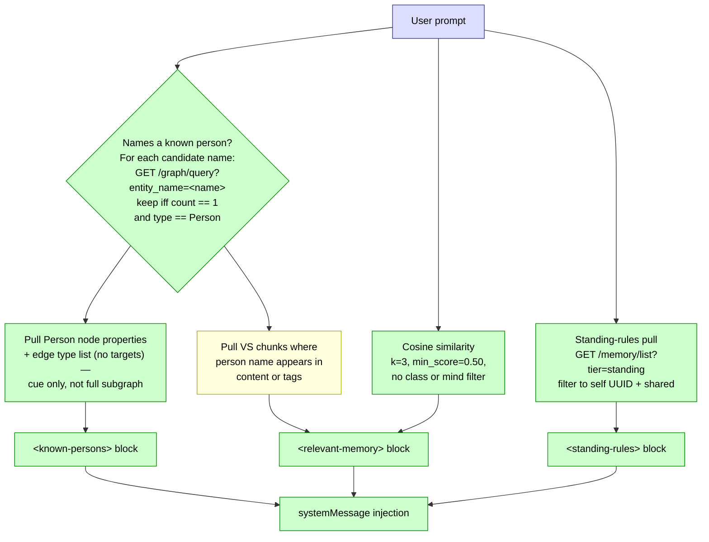

# Per-turn contextual retrieval

What `~/.claude/hooks/contextual_retrieval.py` injects into every user
turn. Three parallel pulls against lucent, three `systemMessage` blocks.



## Three pulls

1. **Standing rules** — `GET /memory/list?tier=standing`, filtered
   client-side to `mind_id == MIND_ID` plus the `shared` sentinel.
   Emitted as `<standing-rules>`.
2. **Cosine similarity** — `GET /memory/retrieve` against the prompt
   text, top-3, `min_score=0.50`, no class or mind filter (cross-hive
   recall). Emitted as part of `<relevant-memory>`.
3. **Known-persons cue** — name candidates from the prompt are checked
   against the KG via `GET /graph/query?entity_name=X`. A name resolves
   only if `count == 1` and `type == "Person"`. For each resolved
   person, pull scalar properties + the **list of edge types present**
   on the node (just type names, not the connected targets). Emitted
   as `<known-persons>`.

All three run unconditionally on every user turn with short timeouts.
On any failure, the hook returns empty rather than blocking.

## Background floor vs foreground depth

The hook injects the **minimum cue** that a person exists in the KG and
what kind of data is available about them — it does **not** pull the
full one-hop subgraph in the background. The subagent running the hook
can't judge which edges matter for the current turn (cooking context vs
medical context vs work context want completely different slices of a
person's graph). That judgment is reserved for the main model.

**What the hook injects:**

```
<known-persons>
- Alex (Person)
  properties: first_name=Alex, last_name=Smith, birthday=...
  edges_available: INTERESTED_IN, HAS_EDUCATION, HAS_HEALTH_FACT,
                   CHILD_OF, SIBLING_OF, LIVES_IN
</known-persons>
```

**What the agent does in-turn:**

The mind has direct `/graph/query?entity_name=X` tool access. When the
`<known-persons>` cue indicates a relevant person and the turn warrants
deeper context, the agent calls `/graph/query` itself, walks the edges
that matter for the question, and uses what comes back. Same harness
pattern as any other tool call.

## VSQ — the one still-designed branch

The `<relevant-memory>` block currently comes from cosine similarity
only. The `VSQ` branch — pulling VS chunks tagged with or mentioning a
resolved person name and merging them into `<relevant-memory>` — is
sketched in the diagram but not yet wired. Cosine recall covers the
common case; VSQ is a precision-boost for prose recall when a name is
the strongest signal but the embedding similarity is weak.
