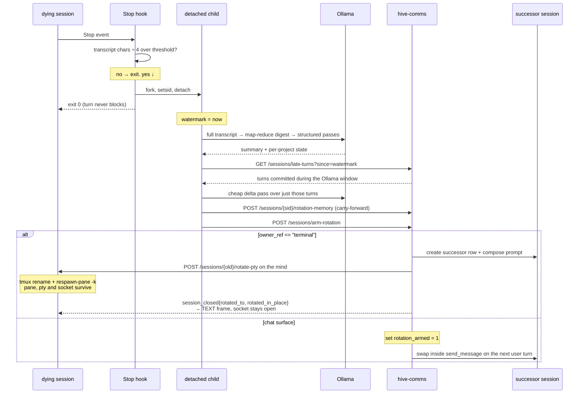

# Session rotation cycle

A session that is about to run out of context is retired and replaced by a
fresh one carrying a distilled summary forward. The Stop hook decides and
does the slow work; hive-comms owns the swap and composes the successor's
opening context.

## The whole loop

## Live implementation

- Hook: `~/.claude/hooks/rotation_check.py` (`~/.codex/hooks/` for Codex
  minds). Edit IS deploy — no staging mirror, no commit step.
- Default threshold: `ROTATION_TOKEN_THRESHOLD=200000`, measured against
  what is actually in the model's context — the last real `usage` block in
  the transcript (Claude) or `last_token_usage.total_tokens` (Codex). File
  size is only the fallback when no measurement is on disk yet: a transcript
  only grows, so bytes ÷ 4 counts turns the model can no longer see and
  rotates a session at a fraction of its real occupancy. Codex's
  `total_token_usage` is cumulative over the whole session and must never be
  thresholded on.
- The real work forks a detached child and the hook returns immediately —
  a rotation takes minutes and must never block the turn that triggered it.
  An `flock` on `rotation-<sid>.lock` keeps concurrent Stops from starting
  rival rotations for the same session.
- Summary strategy: full-transcript map-reduce via Ollama into a digest,
  then structured passes for summary / per-project state. Consecutive
  same-role turns are collapsed before the model sees them.
- The carry-forward is persisted to the NS sessions DB via
  `POST /sessions/{sid}/rotation-memory`, which writes the `session_memory`
  row the successor's prompt is composed from.

## Turns that land mid-rotation

The Ollama pass takes minutes, and the dying session stays live and
answering the whole time. Those turns must not be lost.

- The hook stamps a watermark the moment real work begins, then queries
  `GET /sessions/late-turns?since=<watermark>` before writing the
  carry-forward.
- That reads the durable `session_turns` ledger, not the transcript — a
  turn accepted but never fully answered before the swap exists in the
  ledger and would not be in a transcript tail.
- Trailing user turns with no completed assistant reply become the
  successor's `<pending-continuation>`; a cheap structured delta pass over
  the late turns also refreshes `next_step` and in-flight state.
- `send_message` fills the ledger for chat surfaces. The browser terminal
  bypasses it entirely, so its Stop hook POSTs each completed turn to
  `POST /sessions/record-turn` on every fire when `HIVE_SURFACE=terminal`.

## The swap

`POST /sessions/arm-rotation` is the hook's last step. What it does depends
on whether the surface has a future turn to defer to.

- **Chat surfaces** (Telegram/Discord) set `rotation_armed = 1`. The swap
  happens inside `send_message` on the next user turn, so the rollover
  lands on a user turn and never destroys an assistant reply in flight.
- **Terminal-owned sessions** (`owner_ref == "terminal"`) finalize
  immediately. Keystrokes are raw pty bytes, so `send_message` is never
  called and an armed flag would sit unconsumed forever while the session
  grew into native compaction. Finalizing here is still the last step of
  already-backgrounded work, not a synchronous cost.

Finalizing creates the successor *before* killing the predecessor, so the
new id exists in time to be handed to the mind and to ride out on the
`session_closed` event as `rotated_to`.

### The terminal keeps its pane

A rotation replaces the conversation, not the terminal. Before the old
session is killed, hive-comms calls `POST /sessions/{old_id}/rotate-pty` on
the mind with the successor's id, its conversation id, and the composed
prompt. The mind renames the tmux session to the successor's id and
`respawn-pane -k`s the pane onto a fresh harness process carrying the
carry-forward (`--append-system-prompt` for claude; codex's positional
opening prompt, since it has no such flag). The attached tmux client — and
so the pty, the proxied websocket, and the browser tile — is never touched;
`mind_server` just re-keys the pty handle to the new session id.

`kill_session` then publishes `rotated_in_place` alongside `rotated_to`, and
`ws_attach` answers it with a `{"type": "session_rotated"}` TEXT frame — the
one frame type the mind never sends — and goes on bridging the same socket
under the successor's id. The tile relabels itself and keeps typing.

A rotation with no live terminal under it (the pty was already reaped)
falls back to close code **4412** with the successor id as the reason, and
the tile reattaches. Plain 4410 still means ended with no successor.

## The successor's opening context

Composition is NS-side, in `comms/bootstrap_loader::compose_prompt_blocks`,
and lands in the order the continuation needs:

1. `<soul>`
2. `<recent-memory>` — decay-weighted
3. `<session-memory>` — the rotation carry-forward
4. `<pending-continuation>` — turns that arrived during the window

The mind passes the composed string straight to
`claude --append-system-prompt`. Composition is entirely NS-side; the
`session_memory` table is the only carry-forward store.

## Verifying a rotation

1. Lower `ROTATION_TOKEN_THRESHOLD`, generate transcript, watch
   `data/auto-remember/rotation.log` — the Stop hook should exit in
   milliseconds while the child works.
2. Keep typing during the window. The session answers normally; the turns
   appear in `session_turns`.
3. `ARMED` in the log is followed by a finalize for a terminal session, or
   by a swap on the next user turn for a chat surface.
4. The browser tile never blinks: same pane, same scrollback, and the
   session id in the sidebar changes to the successor's.
5. The successor's opening context shows the carry-forward followed by the
   turns typed during the window.
