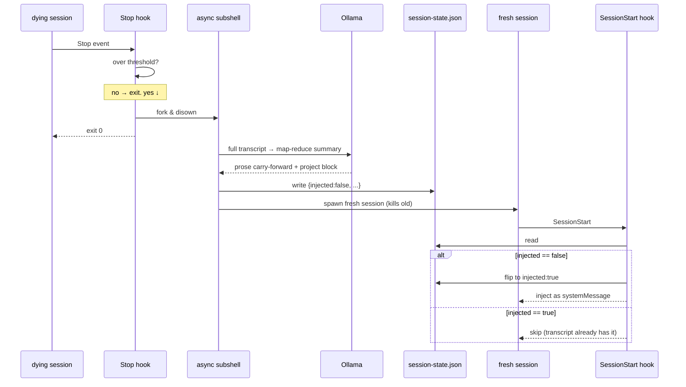

# Session rotation cycle

One file. One flag. Async summary. Same pattern for any mind that hits a
context-window threshold mid-session.

## The whole loop



## Live implementation

- Hook: `~/.claude/hooks/rotation_check.py` (Python). Edit IS deploy —
  no staging mirror.
- Default threshold: `ROTATION_TOKEN_THRESHOLD=100000` (~10% of 1M
  context). Char count ÷ 4 is the proxy.
- Summary strategy: full-transcript map-reduce via Ollama, prose
  carry-forward (no `last_turns` array). Consecutive same-role turns
  are collapsed before the model sees them.
- Rotation memory is also persisted to the NS sessions DB via
  `POST /sessions/{sid}/rotation-memory` — so the carry-forward
  survives even if `session-state.json` is lost.

## `session-state.json`

Path: `<repo-root>/data/session-state.json`
(per-mind path; each mind uses its own data dir).

```json
{
  "injected": false,
  "written_at": "<iso>",
  "client_ref": "telegram:123456",
  "summary": "prose carry-forward — what was happening and what's next",
  "project": {
    "active": true,
    "goal": "one sentence",
    "success_criteria": ["bullet", "bullet"],
    "plan_steps": [{"n": 1, "what": "..."}],
    "completed_steps": [1, 2],
    "current_step": 3,
    "files_touched": [{"path": "...", "lines": "12-47", "why": "..."}],
    "notes": "open questions"
  }
}
```

`project.active: false` → omit project block from inject. The summary
prose still injects.

## Why this works

- **No mid-session pollution.** `injected:true` after first read means a
  service restart mid-session doesn't re-inject content the transcript
  already has.
- **Self-healing on rotation.** Next Stop fires Ollama on a transcript
  that includes the previously-injected summary + all new work → next
  snapshot has the full state. No accumulation needed.
- **No declared-update overhead.** The mind doesn't maintain a file
  during work. Ollama distills at rotation.

## Test plan

1. Force rotation → Stop hook exits <200ms; summary lands within ~15s.
2. Fresh session reads, flips `injected:true`, inject visible in context.
3. Service restart immediately after → SessionStart sees
   `injected:true`, skips inject. No duplicate context.
4. Second forced rotation → new snapshot reflects work done in fresh
   session (project step incremented, new files in `files_touched`).
5. Cold start (no file present) → SessionStart silently proceeds.
