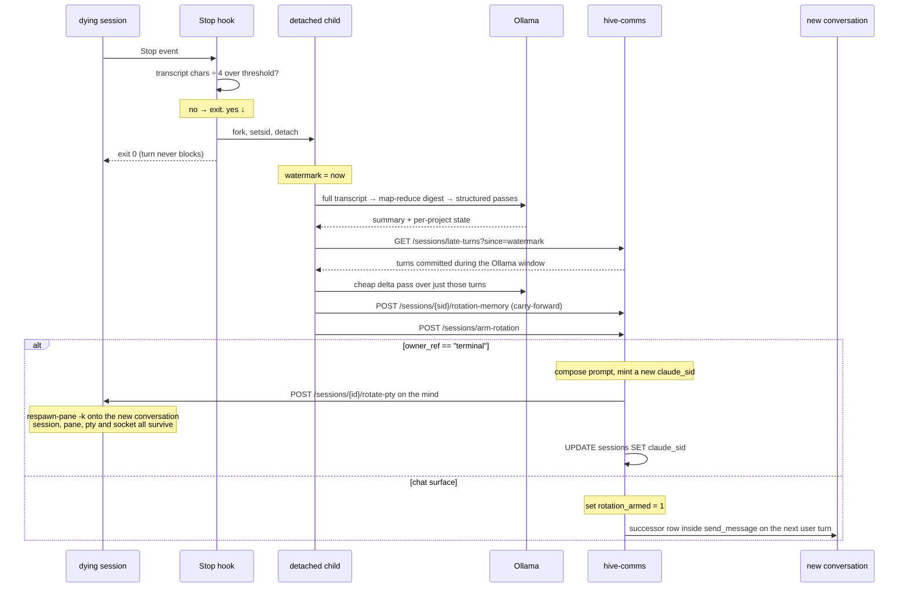

# Session rotation cycle

A conversation that is about to run out of context is replaced by a fresh
one carrying a distilled summary forward. The Stop hook decides and does the
slow work; hive-comms owns the swap and composes the new conversation's
opening context.

What rotates is the *harness conversation*, not always the session. A
terminal session keeps its row, its id and its pane, and only its
`claude_sid` changes. A chat session is retired for a successor row, because
there is no pane to respawn and the surface rebinds on the next turn either
way.

## The whole loop

## Live implementation

- Hook: `~/.claude/hooks/rotation_check.py` (`~/.codex/hooks/` for Codex
  minds). Edit IS deploy — no staging mirror, no commit step.
- Default threshold: `ROTATION_TOKEN_THRESHOLD=200000`, measured against
  what is actually in the model's context — the last real `usage` block in
  the transcript (Claude) or `last_token_usage.total_tokens` (Codex). File
  size is only the fallback when no measurement is on disk yet: a transcript
  only grows, so bytes ÷ 4 counts turns the model can no longer see and
  rotates a session at a fraction of its real occupancy. Codex's
  `total_token_usage` is cumulative over the whole session and must never be
  thresholded on.
- The real work forks a detached child and the hook returns immediately —
  a rotation takes minutes and must never block the turn that triggered it.
  An `flock` on `rotation-<sid>.lock` keeps concurrent Stops from starting
  rival rotations for the same session.
- Summary strategy: full-transcript map-reduce via Ollama into a digest,
  then structured passes for summary / per-project state. Consecutive
  same-role turns are collapsed before the model sees them.
- The carry-forward is persisted to the NS sessions DB via
  `POST /sessions/{sid}/rotation-memory`, which writes the `session_memory`
  row the new conversation's prompt is composed from.

## Turns that land mid-rotation

The Ollama pass takes minutes, and the dying session stays live and
answering the whole time. Those turns must not be lost.

- The hook stamps a watermark the moment real work begins, then queries
  `GET /sessions/late-turns?since=<watermark>` before writing the
  carry-forward.
- That reads the durable `session_turns` ledger, not the transcript — a
  turn accepted but never fully answered before the swap exists in the
  ledger and would not be in a transcript tail.
- Trailing user turns with no completed assistant reply become the new
  conversation's `<pending-continuation>`; a cheap structured delta pass over
  the late turns also refreshes `next_step` and in-flight state.
- `send_message` fills the ledger for chat surfaces. The browser terminal
  bypasses it entirely, so its Stop hook POSTs each completed turn to
  `POST /sessions/record-turn` on every fire when `HIVE_SURFACE=terminal`.

## The swap

`POST /sessions/arm-rotation` is the hook's last step. What it does depends
on whether the surface has a future turn to defer to.

- **Chat surfaces** (Telegram/Discord) set `rotation_armed = 1`. The swap
  happens inside `send_message` on the next user turn, so the rollover
  lands on a user turn and never destroys an assistant reply in flight.
  `_finalize_rotation` creates the successor row *before* killing the
  predecessor, so the new id exists in time to ride out on the
  `session_closed` event as `rotated_to`.
- **Terminal-owned sessions** (`owner_ref == "terminal"`) rotate on the
  spot. Keystrokes are raw pty bytes, so `send_message` is never called and
  an armed flag would sit unconsumed forever while the session grew into
  native compaction. Rotating here is still the last step of
  already-backgrounded work, not a synchronous cost.

### The terminal keeps its session and its pane

The session row is the conversation's permanent identity — the tile, its
label, the `session_turns` ledger and the `active_sessions` binding are all
keyed to the session id. So a terminal rotation moves none of it.
`_rotate_conversation_in_place` composes the prompt, mints a new
`claude_sid`, and calls `POST /sessions/{id}/rotate-pty` on the mind with
that id and the composed prompt. The mind `respawn-pane -k`s the pane onto a
fresh harness process carrying the carry-forward
(`--append-system-prompt` for claude; codex's positional opening prompt,
since it has no such flag) — no rename, nothing killed. The attached tmux
client, the pty, the proxied websocket and the browser tile are never
touched, and `mind_server` just repoints the pty handle's `claude_sid`.

hive-comms then writes that id onto the same row
(`UPDATE sessions SET claude_sid = ?, harness_sid = NULL`). Nothing above
the harness is told anything, because nothing above the harness changed:
the user keeps typing into the same pane under the same session id and only
the context behind it reset.

The carry-forward reaches the pane in a file, not in the tmux command. A
composed prompt runs to tens of thousands of characters; tmux rejects a
`respawn-pane` that long outright with "command too long", and Linux caps a
single argv entry at `MAX_ARG_STRLEN` (128 KiB) besides. The pane command is
a one-line `sh -c` that reads the seed file, deletes it, and `exec`s the
harness with the contents — and `_capped_seed` trims anything over 120,000
chars to its tail first.

When the mind reports no live terminal (the pty was reaped), nothing is
written: there is no pane burning context, and a fresh `claude_sid` with no
process behind it would strand the session on a conversation that was never
started and never seeded.

## The new conversation's opening context

Composition is NS-side, in `comms/bootstrap_loader::compose_prompt_blocks`,
and lands in the order the continuation needs:

1. `<soul>`
2. `<recent-memory>` — decay-weighted
3. `<session-memory>` — the rotation carry-forward
4. `<pending-continuation>` — turns that arrived during the window

The mind passes the composed string straight to
`claude --append-system-prompt`. Composition is entirely NS-side; the
`session_memory` table is the only carry-forward store.

## Verifying a rotation

1. Lower `ROTATION_TOKEN_THRESHOLD`, generate transcript, watch
   `data/auto-remember/rotation.log` — the Stop hook should exit in
   milliseconds while the child works.
2. Keep typing during the window. The session answers normally; the turns
   appear in `session_turns`.
3. `ARMED` in the log is followed by an in-place rotation for a terminal
   session, or by a swap on the next user turn for a chat surface.
4. The browser tile never blinks: same pane, same scrollback, same session
   id — the harness announces a fresh conversation and the context meter
   resets.
5. The new conversation's opening context shows the carry-forward followed
   by the turns typed during the window.
